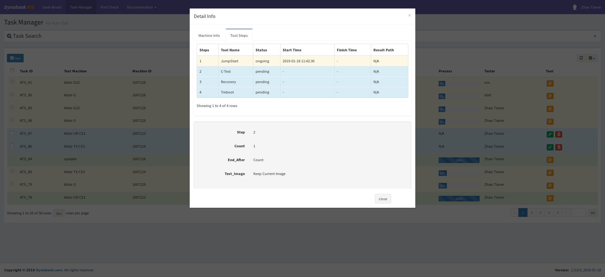
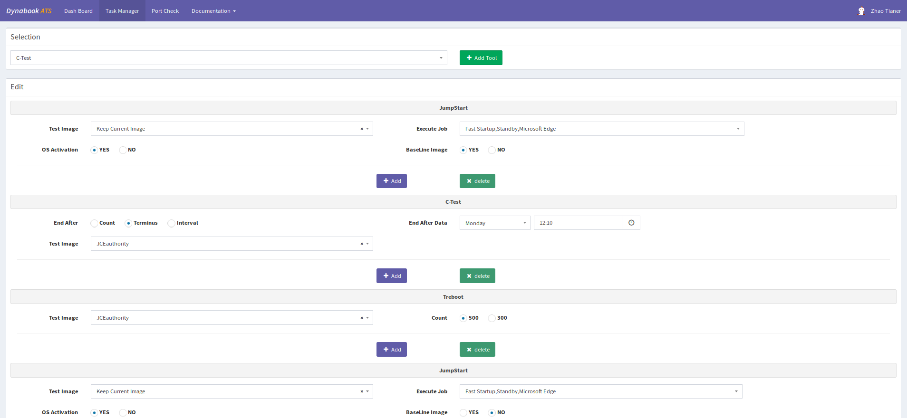
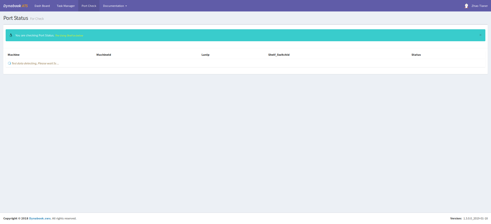

## ATS(Web)

 ### web界面











## 运行环境

> ThinkPHP5的运行环境要求PHP5.4以上。

详细开发文档参考 [ThinkPHP5完全开发手册](http://www.kancloud.cn/manual/thinkphp5)


## Release Note

> ver1.0.0.0   `https://github.com/ss7424Refar/ATS.git`

```
1. Add JumpStart Performance Test
```
> ver1.2.0.0  `https://github.com/ss7424Refar/ats_sizu.git`

```
1. Add JumpStart Performance Test
2. OS Active
3. Image Recovery
```

> ver1.3.0.0  `https://github.com/ss7424Refar/ats_kimi.git`

```
1. Add C-Test and Treboot
2. rebuid web UI and use thinkphp5
```

### 部署(正式)
1. `vi /etc/nginx/sites-available/default`
~~~
location /ats/ {
	index index.php;
	if (!-e $request_filename){
		rewrite ^/ats/(.*)$ /ats/index.php?s=/$1 last;
		break;
	}
}
~~~
2. `要将项目的权限改成757, 因为正式环境是其他组的用户, workman没有权限写入pid文件`
~~~
chmod -R 757 ats
~~~

3. `修改配置config.php中的'app_status'=> ''`
4. `开启workman， php ats/server.php start`

### 其他

1. 个人用的接口, 只是为了做着好玩用于扫码统计自己名下的机子

   ```
   1. http://localhost/ats/personal/index/webscan
   2. http://localhost/ats/services/MachineDetail/export?user=XXX,YYY
   ```
2. Branch
   + `no_dynamic` 任务的panel不是动态添加的
   + `ftp_process`文件通过ftp的方式上传,然而并没有使用   

   