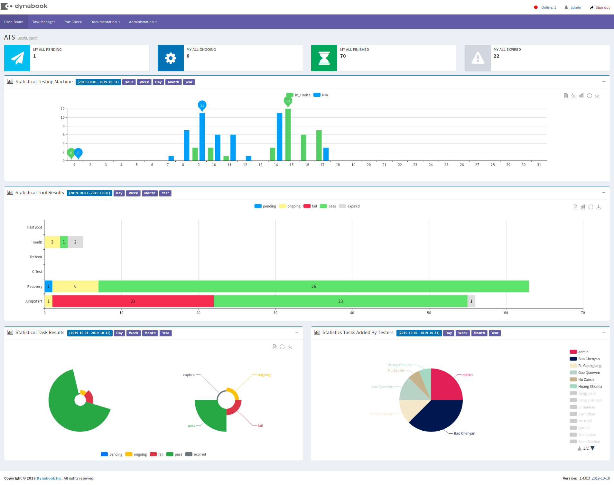
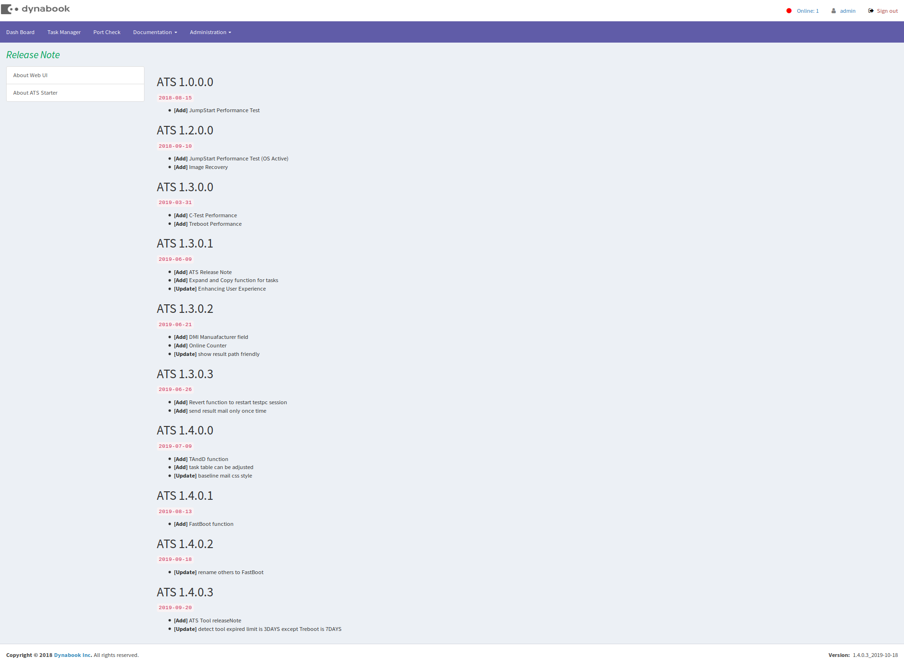

## ATS(Web)

## web界面







## 运行环境

+ php5.4以上
+ nginx
+ mysql5.7以上
+ think php-5.0.24


## 更新记录

| 时间       | 仓库                                        |
| ---------- | ------------------------------------------- |
| 2018-01-28 | https://github.com/ss7424Refar/ATS.git      |
| 2018-07-24 | https://github.com/ss7424Refar/ats_sizu.git |


## 部署本地(docker)

1. 安装git / docker / docker-compose

   1. git

     ```
     https://www.linuxidc.com/Linux/2018-05/152610.htm
     ```

   2. docker / docker-compose

     ```
     https://blog.csdn.net/diligent_lee/article/details/79098302
     ```

2. 部署环境
   1. 下载docker-compose-lnmp.yml

      ```
      cd /opt
      git clone https://github.com/ss7424Refar/docker-start.git
      cd /docker-start/docker-compose-lnmp
      ```

   2. 启动docker-compose

      ```
      docker-compose up -d
      ```

3. 部署项目
   ```
   cd /opt/docker-start/docker-compose-lnmp/html # 项目部署的内容
   git clone https://github.com/ss7424Refar/ats-rebuild
   chmod -R 757 ats-rebuild       # workman / runtime都需要开权限
   mv ats-rebuild ats
   ```

4. 访问
   1. 修改配置文件config_home.php

     ```
     1. database - hostname => 'mysql'  # 容器名字
     2. ats_pe_image => '/home/'        # 随意的路径
     ```

   2. 浏览器打开以下链接
   ```
   http://localhost:8083/ats/index/login/check
   ```
   3. 开启workman/server.php
   ```
   click -> Adminstrator -> server start
   ```


> ※ 以上 `port-check / sendMail` 功能不可用

## 部署正式(lnmp)
   1. 搭建lnmp环境

   2. 修改ngnix配置 `vi /etc/nginx/sites-available/default`
      ```
      location /ats/ {
      	index index.php;
      	if (!-e $request_filename){
      		rewrite ^/ats/(.*)$ /ats/index.php?s=/$1 last;
      		break;
      	}
      }
      ```

   3. 要将项目的权限改成`757`.

      ```
      chmod -R 757 ats
      ```

   4. 修改配置`config.php`中的`'app_status'=> ''`

   5. 开启workman， `click` -> `Adminstrator` -> `server start`


## 其他

1. 个人用的接口(别问，问就是无聊写的)

   ```
   1. http://localhost/ats/personal/index/webscan
   2. http://localhost/ats/services/MachineDetail/export?user=XXX,YYY
   ```
2. Branch
   1. `no_dynamic` task的panel不能动态添加的
   2. `ftp_process` 文件通过ftp的方式上传, 但并没有使用   

3. 2019-06-10 提交

   ```
    之前commit的记录本地git邮箱有误，导致commit为佚名提交.
    rewrite作者之后commit了一遍, pull下来之后再merge再commit到master分支，
    导致之前的commit好的记录变成了2条. 
   ```
